# Une seule porte vers Postgres : `shared/db.py` au runtime, `alembic/env.py` en migration

> **Statut** : Accepté (2026-09-13). Promeut — en les corrigeant — les candidats A12 et A13 de [`docs/architecture.md`](../architecture.md), observés par `/scd-spec-dev:archi` le même jour.

Deux endroits du dépôt ouvrent une connexion à `prosperity.db` (PostgreSQL 17), et aucun autre. **Au runtime**, `backend/shared/db.py` : `build_engine` est le seul `create_async_engine` (asyncpg), `lifespan` l'attache à l'app FastAPI, `get_db` est la seule `Depends` qui livre une `AsyncSession` — et seule elle commite ou rollback (D06, ADR 0015). Onze fichiers l'importent, tous des `transports/http.py` de modules, `backend/main.py`, `backend/transports/imports_http.py` et le script `purge_sync_request_log.py` ; aucun `service`, `domain` ou `repository` ne touche à l'engine. **En migration**, `alembic/env.py` : `async_engine_from_config` sur le `DATABASE_URL` de `backend.config.get_settings()`, et `target_metadata = Base.metadata` de `backend/shared/models.py`, où chaque module enregistre ses tables par le seul effet d'être importé — d'où les cinq lignes `import backend.modules.{accounts,auth,budget,debts,transactions}.models` en tête d'`env.py`.

C'est vrai aujourd'hui, mais **deux choses le fragilisent**. D'abord, rien ne l'écrit : `.importlinter` garde le graphe entre modules (ADR 0005) mais ne dit rien de `sqlalchemy.ext.asyncio` ni d'`alembic/`, qui n'est pas sous `root_package = backend`. Un module qui ouvrirait son propre engine (pour un pool dédié, un `LISTEN/NOTIFY`, un script ad hoc) ne violerait rien. Ensuite, le modèle LikeC4 amorcé ce matin rattachait `alembic/` au store `prosperity.db`, à côté des SQL d'init de `compose/initdb/` — alors qu'`alembic/` est du **code Python du backend** : il importe `backend.config`, `backend.shared.models` et cinq modules, tourne avec les settings de l'API, et le script de conformité aurait signalé chacun de ces imports comme une frontière franchie sans relation (`no-relation`, store → composant). Le candidat A13 tel qu'il avait été écrit (« alembic n'importe jamais `backend.modules.*` ») était d'ailleurs **faux** : le relevé avait raté la forme `import backend.modules…` — ce qu'`alembic/env.py` s'interdit, ce n'est pas d'importer les modules, c'est d'en importer autre chose que leurs `models`.

## Considered Options

- **(A) Statu quo : alembic dans le store `db`, règle « seul `shared/db.py` crée l'engine »** — simple, mais faux deux fois : `env.py` crée aussi un engine, et le store importe six éléments de code sans relation modélisée. La review et la conformité citeraient un modèle qui ment. Rejeté.
- **(B) Un composant `prosperity.api.migrations` (`sourceDir 'alembic'`), deux portes nommées, imports d'alembic bornés aux `models` (retenu)** — alembic devient ce qu'il est : une part du backend, qui dépend de `shared` et des `models` de cinq modules, et qui ouvre sa propre connexion pour migrer. Le store `prosperity.db` ne garde que `compose/initdb/` (rôles, base de stockage PowerSync, publication logique — du SQL exécuté par Postgres au premier démarrage, sans code Python). `api -> db` se précise en `api.shared -> db` et `api.migrations -> db`. Trois relations observables, deux règles falsifiables par grep.
- **(C) Interdire aussi à alembic d'importer les modules : un `models.py` central** — déplacer toutes les tables dans `shared/models.py` pour qu'`env.py` n'importe que `shared`. Contredit ADR 0005 (chaque module possède ses `models`, privés hors `public.py`) et casse la frontière de modules pour un confort de migration. Rejeté.
- **(D) Étendre `.importlinter` à `alembic/`** — `root_packages = backend, alembic` et un contrat `forbidden` sur `alembic -> backend.modules.*.{service,domain,repository,transports,handlers,public}`. Ce n'est pas une alternative à (B) mais sa garde mécanique : retenue en conséquence, à poser par un change.

## Décision

**Option B.** Dans `prosperity.api` :

1. **Deux portes vers `prosperity.db`, et deux seulement.** `prosperity.api.shared` (`backend/shared/db.py` : `build_engine`, `lifespan`, `get_db`) au runtime ; `prosperity.api.migrations` (`alembic/env.py` : `async_engine_from_config`) en migration. Aucun module (`backend/modules/*`), ni `backend/transports`, ni `backend/scripts` ne crée d'engine ni n'ouvre de connexion : ils reçoivent une `AsyncSession` par `get_db`.
2. **`prosperity.api.migrations` n'importe des modules que leurs `models`** (`backend.modules.<m>.models`, pour enregistrer les tables sur `Base.metadata`), plus `backend.shared.models` et `backend.config`. Jamais `service`, `domain`, `repository`, `transports`, `handlers`, ni même `public` : une migration ne raisonne pas sur le métier, elle décrit un schéma. Une migration de données (`op.execute`) écrit du SQL, pas un appel de service.
3. **`prosperity.db` est un store sans code Python** : `compose/initdb/` seul (SQL d'initialisation). Les scripts SQL n'importent rien, par construction.

## Conséquences

- **A12 et A13 deviennent opposables** (`docs/architecture.md`, colonne ADR = 0019), avec leur règle **corrigée** : A12 nomme les deux portes (classe 3, couches), A13 borne les imports d'alembic aux `models` (classe 7, surface d'API). Les Ids ne changent pas ; les règles écrites ce matin étaient des candidats, jamais promus, et fausses — on les corrige plutôt que de laisser deux numéros morts.
- **Le modèle change** : nouveau composant `prosperity.api.migrations`, `prosperity.db` perd `alembic` de son `sourceDir`, `api -> db` remplacé par `api.shared -> db` et `api.migrations -> db`, six relations `migrations -> {shared, accounts, auth, budget, debts, transactions}` « importe models ». Voir §Modèle. Un fichier `alembic/versions/NNNN_*.py` dans un diff est désormais rattaché à `prosperity.api.migrations`, et un import de `service` depuis une migration devient une relation non modélisée **et** une violation d'A13.
- **Une garde mécanique est à poser, par un change** : `.importlinter` étendu à `alembic` (`root_packages`), avec un contrat `forbidden` `alembic -> backend.modules.*.{service,domain,repository,transports,handlers,public}` ; et, pour A12, un test unitaire qui greppe `create_async_engine|async_engine_from_config|create_engine` sous `backend/` et `alembic/` et n'admet que `backend/shared/db.py` et `alembic/env.py` (le patron de `tests/unit/test_importlinter_coverage.py`). Le `design.md` de ce change cite cet ADR. Tant qu'il n'est pas mergé, la review est le seul garde.
- **Un nouveau module** (A09) ajoute sa ligne `import backend.modules.<m>.models` dans `alembic/env.py` **dans le même diff** que son `models.py`, sinon autogenerate ne voit pas ses tables — c'est la relation `migrations -> <m>` à ajouter au `.c4` en même temps.
- **Rien à changer dans le code aujourd'hui** : 2 engines créés (les deux portes), 0 dans les modules ; 7 imports `backend.*` dans `alembic/`, tous `models` ou `config` (mesure du 2026-09-13).

## Modèle

- Éléments touchés : `prosperity.api`, `prosperity.api.shared`, `prosperity.db`, **nouveau** `prosperity.api.migrations`
- Delta : `docs/architecture/model.c4` — `+ api.migrations` (component, `sourceDir 'alembic'`) ; `db.sourceDir` : `['alembic', 'compose/initdb']` → `'compose/initdb'` ; `- api -[sync]-> db` ; `+ api.shared -[sync]-> db`, `+ api.migrations -[sync]-> db` ; `+ migrations -[sync]-> {shared, accounts, auth, budget, debts, transactions}`
- Vue : `adr-0019`

```mermaid
---
title: "ADR 0019 — une seule porte vers Postgres"
---
graph TB
  subgraph ProsperityApi["`API`"]
    ProsperityApi.Sse@{ shape: rectangle, label: "sse" }
    ProsperityApi.Sync@{ shape: rectangle, label: "sync" }
    ProsperityApi.Transports@{ shape: rectangle, label: "transports" }
    ProsperityApi.Migrations@{ shape: rectangle, label: "migrations" }
    ProsperityApi.Banking@{ shape: rectangle, label: "banking" }
    ProsperityApi.Transactions@{ shape: rectangle, label: "transactions" }
    ProsperityApi.Budget@{ shape: rectangle, label: "budget" }
    ProsperityApi.Debts@{ shape: rectangle, label: "debts" }
    ProsperityApi.Accounts@{ shape: rectangle, label: "accounts" }
    ProsperityApi.Auth@{ shape: rectangle, label: "auth" }
    ProsperityApi.Shared@{ shape: rectangle, label: "shared" }
  end
  ProsperityDb@{ shape: disk, label: "Postgres" }
  ProsperityApi.Auth -. "`importe db, http, models`" .-> ProsperityApi.Shared
  ProsperityApi.Accounts -. "`importe db, events, models`" .-> ProsperityApi.Shared
  ProsperityApi.Banking -. "`importe money, bank_labels`" .-> ProsperityApi.Shared
  ProsperityApi.Transactions -. "`importe db, events, money`" .-> ProsperityApi.Shared
  ProsperityApi.Budget -. "`importe db, events, money`" .-> ProsperityApi.Shared
  ProsperityApi.Debts -. "`importe db, events, money`" .-> ProsperityApi.Shared
  ProsperityApi.Sse -. "`importe events, http`" .-> ProsperityApi.Shared
  ProsperityApi.Sync -. "`importe db, events`" .-> ProsperityApi.Shared
  ProsperityApi.Transports -. "`importe db`" .-> ProsperityApi.Shared
  ProsperityApi.Migrations -. "`importe shared.models (Base.metadata)`" .-> ProsperityApi.Shared
  ProsperityApi.Accounts -. "`importe auth.public`" .-> ProsperityApi.Auth
  ProsperityApi.Transactions -. "`importe auth.public`" .-> ProsperityApi.Auth
  ProsperityApi.Budget -. "`importe auth.public`" .-> ProsperityApi.Auth
  ProsperityApi.Debts -. "`importe auth.public`" .-> ProsperityApi.Auth
  ProsperityApi.Sse -. "`importe auth.public`" .-> ProsperityApi.Auth
  ProsperityApi.Sync -. "`importe auth.public`" .-> ProsperityApi.Auth
  ProsperityApi.Transports -. "`importe auth.public`" .-> ProsperityApi.Auth
  ProsperityApi.Migrations -. "`importe auth.models`" .-> ProsperityApi.Auth
  ProsperityApi.Transactions -. "`importe accounts.public`" .-> ProsperityApi.Accounts
  ProsperityApi.Budget -. "`importe accounts.public`" .-> ProsperityApi.Accounts
  ProsperityApi.Debts -. "`importe accounts.public`" .-> ProsperityApi.Accounts
  ProsperityApi.Sync -. "`importe accounts.public`" .-> ProsperityApi.Accounts
  ProsperityApi.Transports -. "`importe accounts.public`" .-> ProsperityApi.Accounts
  ProsperityApi.Migrations -. "`importe accounts.models`" .-> ProsperityApi.Accounts
  ProsperityApi.Transports -. "`importe banking.public`" .-> ProsperityApi.Banking
  ProsperityApi.Transactions -. "`TransactionConfirmedEvent → 
on_transaction_confirmed`" .-> ProsperityApi.Budget
  ProsperityApi.Transactions -. "`TransactionConfirmed/Voided/EditableFieldsChanged 
→ *_overflow`" .-> ProsperityApi.Debts
  ProsperityApi.Debts -. "`importe transactions.public`" .-> ProsperityApi.Transactions
  ProsperityApi.Sync -. "`importe transactions.public`" .-> ProsperityApi.Transactions
  ProsperityApi.Transports -. "`importe transactions.public`" .-> ProsperityApi.Transactions
  ProsperityApi.Migrations -. "`importe transactions.models`" .-> ProsperityApi.Transactions
  ProsperityApi.Budget -. "`BudgetCreated/UpdatedEvent → 
recompute_overflow_on_budget_event`" .-> ProsperityApi.Debts
  ProsperityApi.Debts -. "`importe budget.public`" .-> ProsperityApi.Budget
  ProsperityApi.Sync -. "`importe budget.public`" .-> ProsperityApi.Budget
  ProsperityApi.Migrations -. "`importe budget.models`" .-> ProsperityApi.Budget
  ProsperityApi.Sync -. "`importe debts.public`" .-> ProsperityApi.Debts
  ProsperityApi.Migrations -. "`importe debts.models`" .-> ProsperityApi.Debts
  ProsperityApi.Shared -. "`create_async_engine / get_db 
(shared/db.py)`" .-> ProsperityDb
  ProsperityApi.Migrations -. "`async_engine_from_config 
(alembic/env.py)`" .-> ProsperityDb
```

