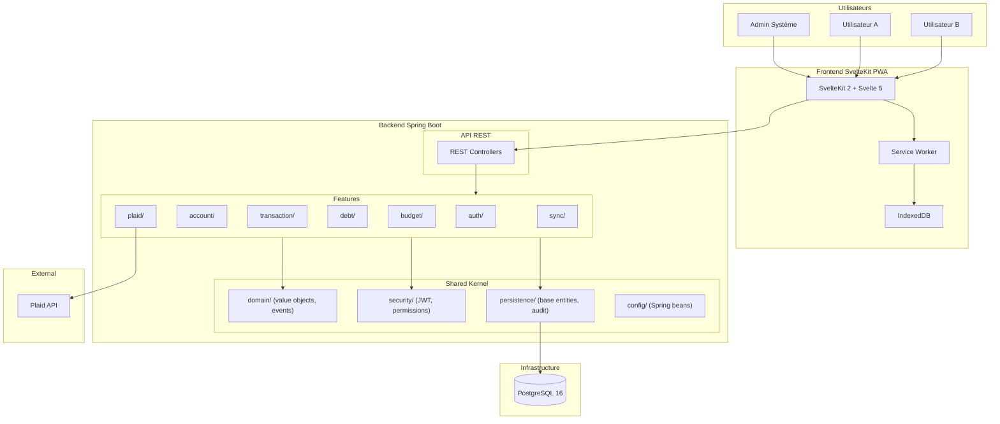

# Prosperity — Document d'Architecture Technique v2

---

## 1. Vue d'Ensemble de l'Architecture

Ce document détaille l'architecture technique révisée de l'application "Prosperity", une solution de gestion financière pour couple, auto-hébergée et sécurisée.

### Principes Directeurs

- **Simplicité du MVP** : Architecture évolutive commençant par les fonctionnalités essentielles
- **Feature-First** : Organisation verticale par domaine fonctionnel plutôt que par couche technique
- **Sécurité par Conception** : Implémentation OWASP avec audit trail complet
- **Performance Mesurée** : Objectif < 200ms P95 (conforme au PRD NFR2)
- **Expérience Offline-First** : PWA SvelteKit avec synchronisation robuste et résolution de conflits

### Changements par rapport à la v1

Le document d'architecture v1 reposait sur une architecture hexagonale classique (4 couches : `domain`, `application`, `infrastructure`, `api`) et un frontend React 19. Cette révision apporte deux changements structurels majeurs :

**Frontend : React → Svelte 5 + SvelteKit 2.** SvelteKit apporte nativement le routage basé fichiers, le SSR/SSG, les form actions, et un modèle de données serveur via les fonctions `load`. Le système de réactivité fine-grained de Svelte 5 (runes `$state`, `$derived`, `$effect`) élimine le besoin de librairies de state management externes (Zustand, TanStack Query) pour la majorité des cas d'usage. Le résultat est un bundle plus léger, moins de boilerplate, et une DX plus directe.

**Backend : Hexagonale 4 couches → Vertical Slice avec Domain Kernel.** L'architecture hexagonale complète introduisait une cérémonie excessive pour un projet à 2 utilisateurs développé en solo : mappers entre couches, ports/adapters formels, navigation constante entre packages techniques. L'architecture Vertical Slice organise le code par fonctionnalité métier (account, transaction, debt, budget) avec un kernel partagé pour les préoccupations transversales (sécurité, persistence de base, configuration). Chaque feature est autonome et contient son controller, service, repository et DTOs. Cette approche réduit la charge cognitive, accélère la navigation dans le code, et reste parfaitement compatible avec une extraction en modules si le projet grandit.

---

## 2. Architecture Globale du Système

### 2.1 Vue d'Ensemble



### 2.2 Composants Principaux

L'application se compose de trois blocs :

Le **frontend SvelteKit** sert d'interface PWA avec capacités offline. SvelteKit gère le routage, le chargement de données côté serveur (fonctions `load`), et les mutations (form actions). Le Service Worker et IndexedDB assurent la persistance locale et la synchronisation différée.

Le **backend Spring Boot** expose une API REST consommée par le frontend. Le code est organisé par fonctionnalité métier (vertical slices) avec un kernel partagé pour les préoccupations transversales. Chaque feature encapsule sa logique complète : controller, service, repository, DTOs et entités JPA.

L'**infrastructure** se réduit à PostgreSQL pour la persistance. Redis est retiré du MVP — le cache applicatif sera géré par les mécanismes natifs de Spring (`@Cacheable` avec `ConcurrentMapCacheManager` en mémoire) et ne sera externalisé vers Redis que si les métriques l'imposent.

### 2.3 Décision : Pas de Redis au MVP

Le document v1 incluait Redis pour le cache et les queues d'événements. Pour un projet à 2 utilisateurs avec des volumes de données modestes (< 50k transactions sur 5 ans), cette complexité n'est pas justifiée au MVP :

- Le cache en mémoire de Spring Boot (`ConcurrentMapCacheManager`) couvre les besoins de cache applicatif pour 2 utilisateurs concurrents.
- Les événements applicatifs de Spring (`@EventListener`, `@Async`) remplacent la queue Redis pour la communication interne.
- Le WebSocket natif de Spring suffit pour les notifications temps réel entre 2 clients.

Si les performances l'exigent post-MVP, Redis peut être introduit sans changement architectural : il suffit de remplacer le `CacheManager` et d'ajouter le starter Spring Data Redis.

---

## 3. Architecture Backend

### 3.1 Vertical Slice Architecture avec Domain Kernel

L'architecture organise le code par fonctionnalité métier. Chaque "slice" contient tout ce qui est nécessaire à une feature, de l'endpoint REST jusqu'au repository. Un kernel partagé (`shared/`) fournit les éléments transversaux.

```
src/main/java/fr/kalifazzia/prosperity/
│
├── shared/                              # Kernel partagé — préoccupations transversales
│   ├── domain/                          # Value objects et événements métier partagés
│   │   ├── Money.java                   # record Money(BigDecimal amount, Currency currency)
│   │   ├── UserId.java                  # record UserId(UUID value)
│   │   ├── AccountId.java               # record AccountId(UUID value)
│   │   └── DomainEvent.java             # sealed interface pour événements métier
│   │
│   ├── security/                        # Sécurité transversale
│   │   ├── SecurityConfig.java          # Configuration Spring Security + JWT
│   │   ├── JwtTokenProvider.java        # Génération/validation JWT
│   │   ├── JwtAuthFilter.java           # Filtre d'authentification
│   │   ├── PermissionEvaluator.java     # Évaluation des permissions par compte
│   │   └── SecurityAuditor.java         # Audit des accès
│   │
│   ├── persistence/                     # Base de persistence partagée
│   │   ├── BaseEntity.java              # Mapped superclass (id, createdAt, updatedAt, version)
│   │   ├── AuditLog.java                # Entité d'audit trail
│   │   ├── AuditLogRepository.java
│   │   └── AuditingConfig.java          # JPA Auditing (@CreatedDate, @LastModifiedDate)
│   │
│   ├── web/                             # Préoccupations web transversales
│   │   ├── GlobalExceptionHandler.java  # @RestControllerAdvice
│   │   ├── ApiError.java                # record pour réponses d'erreur
│   │   └── RateLimitFilter.java         # Rate limiting par IP/utilisateur
│   │
│   └── config/                          # Configuration Spring Boot
│       ├── AsyncConfig.java             # Virtual threads executor
│       ├── JacksonConfig.java           # Sérialisation JSON
│       └── CorsConfig.java             # CORS restrictif
│
├── auth/                                # Feature : Authentification
│   ├── AuthController.java              # POST /api/auth/login, /api/auth/refresh
│   ├── AuthService.java                 # Logique d'authentification
│   ├── RefreshToken.java                # Entité JPA
│   ├── RefreshTokenRepository.java
│   ├── LoginRequest.java                # record DTO
│   ├── LoginResponse.java               # record DTO
│   └── TokenRefreshRequest.java         # record DTO
│
├── user/                                # Feature : Gestion utilisateurs
│   ├── UserController.java              # CRUD utilisateurs (admin)
│   ├── UserService.java
│   ├── User.java                        # Entité JPA
│   ├── UserRepository.java
│   ├── SystemRole.java                  # enum (ADMIN, STANDARD)
│   ├── UserDto.java                     # record DTO
│   └── UserProfileDto.java             # record DTO
│
├── account/                             # Feature : Comptes bancaires
│   ├── AccountController.java           # CRUD comptes + gestion permissions
│   ├── AccountService.java
│   ├── Account.java                     # Entité JPA
│   ├── AccountRepository.java
│   ├── AccountType.java                 # enum PERSONAL, SHARED
│   ├── Permission.java                  # Entité JPA (granularité par compte)
│   ├── PermissionRepository.java
│   ├── PermissionLevel.java             # enum READ, WRITE, MANAGE
│   ├── AccountDto.java                  # record DTO
│   ├── CreateAccountRequest.java        # record DTO
│   └── PermissionDto.java               # record DTO
│
├── transaction/                         # Feature : Transactions financières
│   ├── TransactionController.java       # CRUD transactions + filtres
│   ├── TransactionService.java          # Logique métier transactions
│   ├── Transaction.java                 # Entité JPA
│   ├── TransactionRepository.java
│   ├── Category.java                    # Entité JPA
│   ├── CategoryRepository.java
│   ├── SyncStatus.java                  # enum SYNCED, PENDING, CONFLICT
│   ├── TransactionDto.java              # record DTO
│   ├── CreateTransactionRequest.java    # record DTO
│   └── QuickAddRequest.java             # record DTO (saisie rapide mobile)
│
├── debt/                                # Feature : Dettes internes
│   ├── DebtController.java              # CRUD dettes + équilibrage
│   ├── DebtService.java                 # Calculs de soldes, suggestions
│   ├── Debt.java                        # Entité JPA
│   ├── DebtRepository.java
│   ├── DebtStatus.java                  # enum PENDING, ACKNOWLEDGED, SETTLED, DISPUTED
│   ├── DebtDto.java                     # record DTO
│   ├── DebtBalanceDto.java              # record DTO (solde consolidé)
│   └── SettlementSuggestionDto.java     # record DTO
│
├── budget/                              # Feature : Budgétisation
│   ├── BudgetController.java            # CRUD budgets + suivi
│   ├── BudgetService.java               # Calculs d'utilisation, alertes
│   ├── Budget.java                      # Entité JPA
│   ├── BudgetRepository.java
│   ├── BudgetDto.java                   # record DTO
│   └── BudgetProgressDto.java           # record DTO (% utilisé, projection)
│
├── plaid/                               # Feature : Intégration Plaid
│   ├── PlaidController.java             # Link token, webhooks
│   ├── PlaidService.java                # Sync, enrichissement
│   ├── PlaidItem.java                   # Entité JPA (token chiffré AES-256)
│   ├── PlaidItemRepository.java
│   ├── PlaidWebhookHandler.java         # Traitement webhooks
│   ├── PlaidSyncJob.java                # @Scheduled sync périodique
│   └── PlaidHealthIndicator.java        # Health check Plaid
│
├── sync/                                # Feature : Synchronisation offline
│   ├── SyncController.java              # POST /api/sync (batch operations)
│   ├── SyncService.java                 # Réconciliation, merge
│   ├── ConflictDetector.java            # Détection doublons/conflits
│   ├── ConflictResolution.java          # Entité JPA
│   ├── ConflictResolutionRepository.java
│   ├── SyncOperation.java               # record (opération à synchroniser)
│   └── ConflictDto.java                 # record DTO
│
└── dashboard/                           # Feature : Tableau de bord
    ├── DashboardController.java         # GET /api/dashboard (vue agrégée)
    ├── DashboardService.java            # Agrégation des données
    └── DashboardDto.java                # record DTO (soldes, budgets, dettes, transactions récentes)
```

### 3.2 Pourquoi Vertical Slice plutôt qu'Hexagonale

L'architecture hexagonale classique (4 couches) présente des inconvénients concrets pour ce projet :

**Navigation pénible.** Pour comprendre la feature "dette", il faut naviguer entre `domain/entities/Debt.java`, `domain/services/DebtDomainService.java`, `application/services/DebtApplicationService.java`, `application/dto/DebtDto.java`, `application/mappers/DebtMapper.java`, `infrastructure/persistence/DebtJpaEntity.java`, `infrastructure/persistence/DebtJpaRepository.java`, et `api/rest/DebtController.java`. Avec le vertical slice, tout est dans `debt/` — 8 fichiers dans le même répertoire.

**Mappers superflus.** L'hexagonale impose de mapper entre entité de domaine, entité JPA, DTO applicatif et DTO de présentation. Pour un projet personnel à 2 utilisateurs, cette indirection n'apporte que du boilerplate. Dans l'approche verticale, l'entité JPA sert de modèle de domaine (pragmatisme assumé) et les records DTOs gèrent la sérialisation.

**Fausse sécurité architecturale.** Les règles de dépendance de l'hexagonale (le domaine ne dépend de rien) sont élégantes en théorie. En pratique, sur un projet solo, elles ajoutent de la friction sans apporter de bénéfice concret — il n'y a pas d'équipe à protéger d'une mauvaise dépendance.

**L'approche verticale reste évolutive.** Si une feature devient trop complexe, elle peut être restructurée en sous-packages (`transaction/import/`, `transaction/sync/`, `transaction/categorization/`) ou extraite en module Maven. Le point de départ est simple, l'évolution est progressive.

### 3.3 Le Domain Kernel : ce qui reste partagé

Le package `shared/` contient les éléments qui traversent les features :

**Value Objects typés** (`shared/domain/`). Les identifiants typés (`UserId`, `AccountId`, `Money`) évitent les erreurs de paramètres et documentent le code. Ils restent des records Java simples sans logique métier complexe.

```java
public record UserId(UUID value) {
    public UserId { Objects.requireNonNull(value, "UserId cannot be null"); }
}

public record Money(BigDecimal amount, Currency currency) {
    public Money {
        Objects.requireNonNull(amount);
        Objects.requireNonNull(currency);
    }
    public Money add(Money other) {
        if (!currency.equals(other.currency)) throw new IllegalArgumentException("Currency mismatch");
        return new Money(amount.add(other.amount), currency);
    }
    public Money negate() {
        return new Money(amount.negate(), currency);
    }
}
```

**Événements de domaine** (`shared/domain/`). Les features communiquent entre elles via des événements Spring applicatifs, pas par dépendance directe.

```java
public sealed interface DomainEvent permits
    TransactionCreated, TransactionUpdated,
    DebtCreated, DebtSettled,
    BudgetThresholdReached,
    PlaidSyncCompleted {

    Instant occurredAt();
}

public record TransactionCreated(
    AccountId accountId,
    UUID transactionId,
    Money amount,
    Instant occurredAt
) implements DomainEvent {}
```

**Sécurité** (`shared/security/`). La configuration Spring Security, le filtre JWT et l'évaluateur de permissions sont transversaux par nature.

**Persistence de base** (`shared/persistence/`). Le `BaseEntity` (avec `@Version` pour l'optimistic locking et `@CreatedDate`/`@LastModifiedDate` pour l'audit) et le système d'audit log sont partagés.

### 3.4 Conventions au sein d'une Feature

Chaque feature suit les mêmes conventions :

```
feature/
├── FeatureController.java      # @RestController, validation des entrées, délègue au service
├── FeatureService.java         # Logique métier, gestion transactionnelle, émission d'événements
├── Feature.java                # @Entity JPA, extends BaseEntity
├── FeatureRepository.java      # interface extends JpaRepository
├── FeatureDto.java             # record(s) pour les réponses API
├── CreateFeatureRequest.java   # record avec @Valid pour les requêtes
└── FeatureXxxDto.java          # records additionnels si nécessaire
```

**Le controller** reçoit la requête, valide via Bean Validation (`@Valid`), appelle le service, et retourne le DTO. Il ne contient aucune logique métier.

**Le service** encapsule toute la logique métier. Il est annoté `@Service` et `@Transactional`. Il vérifie les permissions via `@PreAuthorize` ou le `PermissionEvaluator`. Il émet des événements de domaine via `ApplicationEventPublisher`.

**L'entité JPA** sert directement de modèle de domaine. C'est un compromis pragmatique : on accepte le couplage à JPA en échange de l'élimination des mappers. Si demain ce couplage pose problème (tests unitaires purs, migration ORM), on pourra introduire une couche de mapping dans la feature concernée sans impacter les autres.

**Les DTOs** sont des records Java immutables. Ils servent de contrat API et incluent la validation Bean Validation directement.

```java
public record CreateTransactionRequest(
    @NotNull AccountId accountId,
    @NotNull @Positive BigDecimal amount,
    @NotBlank @Size(max = 500) String description,
    @NotNull LocalDate date,
    UUID categoryId
) {}
```

### 3.5 Communication Inter-Features

Les features ne s'appellent jamais directement. Elles communiquent via deux mécanismes :

**Événements Spring** pour les effets de bord asynchrones. Quand une transaction est créée, le `TransactionService` publie un `TransactionCreated`. Le `DebtService` écoute cet événement pour vérifier si la transaction génère une dette. Le `BudgetService` écoute pour mettre à jour la consommation budgétaire.

```java
// Dans TransactionService
@Transactional
public TransactionDto createTransaction(CreateTransactionRequest request) {
    var transaction = new Transaction(/* ... */);
    transaction = transactionRepository.save(transaction);

    eventPublisher.publishEvent(new TransactionCreated(
        request.accountId(),
        transaction.getId(),
        new Money(request.amount(), Currency.getInstance("EUR")),
        Instant.now()
    ));

    return TransactionDto.from(transaction);
}

// Dans BudgetService
@EventListener
public void onTransactionCreated(TransactionCreated event) {
    budgetRepository.findByAccountAndMonth(event.accountId(), YearMonth.now())
        .ifPresent(budget -> {
            budget.addSpending(event.amount());
            budgetRepository.save(budget);
            if (budget.utilizationPercent() >= budget.alertThreshold()) {
                eventPublisher.publishEvent(new BudgetThresholdReached(/* ... */));
            }
        });
}
```

**Injection du Repository** pour les lectures synchrones simples. Si le `DashboardService` a besoin de lire les soldes des comptes, il injecte directement le `AccountRepository`. C'est une lecture, pas un couplage métier.

### 3.6 Modèle de Données

Le schéma de données reste identique à la v1. Les entités JPA et le schéma SQL ne changent pas avec l'architecture Vertical Slice — seule l'organisation du code Java diffère.

```sql
-- Utilisateurs et Rôles
CREATE TABLE users (
    id UUID PRIMARY KEY,
    email VARCHAR(255) UNIQUE NOT NULL,
    password_hash VARCHAR(255) NOT NULL,
    system_role VARCHAR(50) NOT NULL, -- ADMIN, STANDARD
    created_at TIMESTAMP NOT NULL,
    updated_at TIMESTAMP NOT NULL,
    version BIGINT NOT NULL DEFAULT 0
);

-- Comptes bancaires
CREATE TABLE accounts (
    id UUID PRIMARY KEY,
    name VARCHAR(255) NOT NULL,
    account_type VARCHAR(20) NOT NULL, -- PERSONAL, SHARED
    owner_id UUID REFERENCES users(id),
    institution_name VARCHAR(255),
    is_active BOOLEAN DEFAULT true,
    created_at TIMESTAMP NOT NULL,
    updated_at TIMESTAMP NOT NULL,
    version BIGINT NOT NULL DEFAULT 0
);

-- Permissions granulaires
CREATE TABLE permissions (
    id UUID PRIMARY KEY,
    account_id UUID REFERENCES accounts(id),
    user_id UUID REFERENCES users(id),
    permission_level VARCHAR(20) NOT NULL, -- READ, WRITE, MANAGE
    granted_by_user_id UUID REFERENCES users(id),
    granted_at TIMESTAMP NOT NULL,
    revoked_at TIMESTAMP,
    UNIQUE(account_id, user_id, permission_level)
);

-- Tokens Plaid chiffrés
CREATE TABLE plaid_items (
    id UUID PRIMARY KEY,
    account_id UUID REFERENCES accounts(id),
    access_token_encrypted TEXT NOT NULL,
    item_id VARCHAR(255) NOT NULL,
    institution_id VARCHAR(100),
    last_sync_at TIMESTAMP,
    webhook_url VARCHAR(500),
    created_at TIMESTAMP NOT NULL
);

-- Catégories
CREATE TABLE categories (
    id UUID PRIMARY KEY,
    name VARCHAR(100) NOT NULL,
    icon VARCHAR(50),
    color VARCHAR(7),
    is_default BOOLEAN DEFAULT false,
    created_by UUID REFERENCES users(id),
    created_at TIMESTAMP NOT NULL
);

-- Transactions
CREATE TABLE transactions (
    id UUID PRIMARY KEY,
    account_id UUID REFERENCES accounts(id),
    plaid_transaction_id VARCHAR(255) UNIQUE,
    date DATE NOT NULL,
    amount DECIMAL(19,4) NOT NULL,
    description TEXT,
    category_id UUID REFERENCES categories(id),
    is_pending BOOLEAN DEFAULT false,
    sync_status VARCHAR(20) DEFAULT 'SYNCED',
    conflict_data JSONB,
    created_by UUID REFERENCES users(id),
    created_at TIMESTAMP NOT NULL,
    updated_at TIMESTAMP NOT NULL,
    version BIGINT NOT NULL DEFAULT 0
);

-- Budgets mensuels
CREATE TABLE budgets (
    id UUID PRIMARY KEY,
    account_id UUID REFERENCES accounts(id),
    category_id UUID REFERENCES categories(id),
    budget_type VARCHAR(20) NOT NULL DEFAULT 'ENVELOPE', -- ENVELOPE (dépenser), SAVINGS_GOAL (épargne)
    amount DECIMAL(19,4) NOT NULL,
    spent DECIMAL(19,4) NOT NULL DEFAULT 0,
    month INTEGER NOT NULL,
    year INTEGER NOT NULL,
    alert_thresholds JSONB NOT NULL DEFAULT '[75, 90, 100]', -- seuils d'alertes progressives (%)
    template_id UUID REFERENCES budget_templates(id),
    created_at TIMESTAMP NOT NULL,
    updated_at TIMESTAMP NOT NULL,
    UNIQUE(account_id, category_id, month, year)
);

-- Templates de budgets prédéfinis
CREATE TABLE budget_templates (
    id UUID PRIMARY KEY,
    name VARCHAR(100) NOT NULL,
    categories JSONB NOT NULL, -- [{categoryId, amount, budgetType}]
    is_default BOOLEAN DEFAULT false,
    created_by UUID REFERENCES users(id),
    created_at TIMESTAMP NOT NULL
);

-- Dettes internes
CREATE TABLE debts (
    id UUID PRIMARY KEY,
    creditor_user_id UUID REFERENCES users(id),
    debtor_user_id UUID REFERENCES users(id),
    amount DECIMAL(19,4) NOT NULL,
    description TEXT,
    transaction_id UUID REFERENCES transactions(id),
    status VARCHAR(20) NOT NULL, -- PENDING, ACKNOWLEDGED, SETTLED, DISPUTED
    due_date DATE,
    settled_at TIMESTAMP,
    created_at TIMESTAMP NOT NULL,
    updated_at TIMESTAMP NOT NULL
);

-- Résolutions de conflits
CREATE TABLE conflict_resolutions (
    id UUID PRIMARY KEY,
    local_transaction_id UUID REFERENCES transactions(id),
    remote_transaction_id UUID REFERENCES transactions(id),
    resolution_type VARCHAR(30) NOT NULL,
    resolved_by UUID REFERENCES users(id),
    resolved_at TIMESTAMP NOT NULL,
    expires_at TIMESTAMP NOT NULL, -- Undo window 24h
    is_undone BOOLEAN DEFAULT false
);

-- Audit trail
CREATE TABLE audit_log (
    id UUID PRIMARY KEY,
    entity_type VARCHAR(50) NOT NULL,
    entity_id UUID NOT NULL,
    action VARCHAR(50) NOT NULL,
    user_id UUID REFERENCES users(id),
    old_values JSONB,
    new_values JSONB,
    ip_address INET,
    performed_at TIMESTAMP NOT NULL DEFAULT NOW()
);

-- Index pour performance
CREATE INDEX idx_transactions_account_date ON transactions(account_id, date DESC);
CREATE INDEX idx_transactions_sync_status ON transactions(sync_status) WHERE sync_status != 'SYNCED';
CREATE INDEX idx_audit_log_entity ON audit_log(entity_type, entity_id, performed_at DESC);
CREATE INDEX idx_permissions_user_account ON permissions(user_id, account_id);
CREATE INDEX idx_debts_users ON debts(creditor_user_id, debtor_user_id, status);
CREATE INDEX idx_budgets_period ON budgets(account_id, year, month);
```

### 3.7 Sécurité et Authentification

La configuration sécurité reste dans le kernel partagé. Le modèle de permissions est inchangé par rapport à la v1.

```java
@Configuration
@EnableMethodSecurity
public class SecurityConfig {

    @Bean
    public SecurityFilterChain filterChain(HttpSecurity http) {
        return http
            .csrf(csrf -> csrf
                .csrfTokenRepository(CookieCsrfTokenRepository.withHttpOnlyFalse()))
            .sessionManagement(session -> session
                .sessionCreationPolicy(SessionCreationPolicy.STATELESS))
            .authorizeHttpRequests(auth -> auth
                .requestMatchers("/api/auth/**").permitAll()
                .requestMatchers("/actuator/health").permitAll()
                .requestMatchers("/api/admin/**").hasRole("SYSTEM_ADMIN")
                .anyRequest().authenticated())
            .addFilterBefore(jwtAuthFilter, UsernamePasswordAuthenticationFilter.class)
            .build();
    }

    @Bean
    public PasswordEncoder passwordEncoder() {
        return new BCryptPasswordEncoder(12);
    }
}
```

Les permissions par compte sont vérifiées au niveau service via `@PreAuthorize` :

```java
@Service
@Transactional
public class TransactionService {

    @PreAuthorize("@permissionEvaluator.hasPermission(#request.accountId(), 'WRITE')")
    public TransactionDto createTransaction(CreateTransactionRequest request) {
        // ...
    }

    @PreAuthorize("@permissionEvaluator.hasPermission(#accountId, 'READ')")
    public List<TransactionDto> listTransactions(AccountId accountId, Pageable pageable) {
        // ...
    }
}
```

### 3.8 Virtual Threads et Performance

```java
@Configuration
public class AsyncConfig {

    @Bean
    public ExecutorService virtualThreadExecutor() {
        return Executors.newVirtualThreadPerTaskExecutor();
    }

    @Bean
    public AsyncTaskExecutor asyncExecutor() {
        return new TaskExecutorAdapter(virtualThreadExecutor());
    }
}
```

Spring Boot 3.2+ supporte nativement les virtual threads via `spring.threads.virtual.enabled=true`. Les opérations I/O (appels Plaid, imports batch) bénéficient automatiquement de cette configuration sans changement de code.

### 3.9 Monitoring Essentiel

```java
// Dans shared/persistence/
@Component
public class AppHealthIndicator implements HealthIndicator {

    private final DataSource dataSource;

    @Override
    public Health health() {
        var builder = Health.up();
        // Vérification connexion DB
        try (var conn = dataSource.getConnection()) {
            builder.withDetail("database", "connected");
        } catch (Exception e) {
            return Health.down().withDetail("database", e.getMessage()).build();
        }
        return builder.build();
    }
}
```

Les métriques métier sont collectées par feature via `@EventListener` dans chaque service, sans composant centralisé artificiel. Les logs structurés via Logback avec rotation quotidienne couvrent les besoins de monitoring MVP.

---

## 4. Architecture Frontend — Svelte 5 + SvelteKit 2

### 4.1 Pourquoi Svelte 5 + SvelteKit plutôt que React

**Bundle size réduit.** Svelte compile les composants en JavaScript impératif — pas de runtime virtuel DOM. Pour une PWA offline-first où chaque KB compte (contrainte 3G, cache Service Worker limité à 50MB), c'est un avantage concret.

**Réactivité native sans librairies externes.** Le système de runes de Svelte 5 (`$state`, `$derived`, `$effect`) remplace à lui seul Zustand (state management) et la majorité des cas d'usage de TanStack Query (cache serveur). La réactivité est fine-grained : seuls les éléments DOM affectés sont mis à jour, sans réconciliation de VDOM.

**SvelteKit couvre les besoins structurels.** Le routage basé fichiers, les fonctions `load` pour le data fetching, les form actions pour les mutations, le SSR natif — tout ce qui nécessitait des librairies tierces avec React (React Router, TanStack Query, Next.js) est intégré dans SvelteKit.

**Courbe d'apprentissage alignée avec les objectifs.** Le PRD identifie ce projet comme un terrain d'apprentissage. L'écosystème Svelte/SvelteKit, plus compact, permet de maîtriser l'ensemble du framework plutôt que de naviguer dans un écosystème fragmenté.

### 4.2 Structure du Projet SvelteKit

```
prosperity-web/
├── src/
│   ├── routes/                          # Routage basé fichiers (SvelteKit)
│   │   ├── +layout.svelte               # Layout racine (nav, thème, online indicator)
│   │   ├── +layout.ts                   # Load global (session, préférences)
│   │   ├── +page.svelte                 # Page d'accueil → redirige vers /dashboard
│   │   │
│   │   ├── auth/
│   │   │   ├── login/
│   │   │   │   ├── +page.svelte         # Formulaire de connexion
│   │   │   │   └── +page.server.ts      # Form action : authentification
│   │   │   └── +layout.svelte           # Layout auth (centré, sans nav)
│   │   │
│   │   ├── dashboard/
│   │   │   ├── +page.svelte             # Tableau de bord principal
│   │   │   └── +page.ts                 # Load : soldes, budgets, dettes, transactions récentes
│   │   │
│   │   ├── accounts/
│   │   │   ├── +page.svelte             # Liste des comptes
│   │   │   ├── +page.ts                 # Load : comptes avec permissions
│   │   │   ├── [id]/
│   │   │   │   ├── +page.svelte         # Détail d'un compte (transactions, filtres)
│   │   │   │   ├── +page.ts             # Load : transactions paginées
│   │   │   │   └── permissions/
│   │   │   │       └── +page.svelte     # Gestion des permissions (propriétaire)
│   │   │   └── new/
│   │   │       ├── +page.svelte         # Création de compte
│   │   │       └── +page.server.ts      # Form action : création
│   │   │
│   │   ├── transactions/
│   │   │   ├── +page.svelte             # Vue globale des transactions
│   │   │   ├── +page.ts                 # Load : transactions multi-comptes
│   │   │   ├── new/
│   │   │   │   ├── +page.svelte         # Saisie complète
│   │   │   │   └── +page.server.ts      # Form action
│   │   │   └── quick-add/
│   │   │       └── +page.svelte         # Saisie rapide mobile (≤ 3 taps)
│   │   │
│   │   ├── budgets/
│   │   │   ├── +page.svelte             # Vue budgets du mois
│   │   │   ├── +page.ts                 # Load : budgets avec progression
│   │   │   └── [id]/
│   │   │       └── +page.svelte         # Détail/édition d'un budget
│   │   │
│   │   ├── debts/
│   │   │   ├── +page.svelte             # Suivi des dettes
│   │   │   ├── +page.ts                 # Load : soldes, historique
│   │   │   └── settle/
│   │   │       └── +page.svelte         # Formulaire de règlement
│   │   │
│   │   ├── sync/
│   │   │   └── conflicts/
│   │   │       ├── +page.svelte         # Résolution des conflits
│   │   │       └── +page.ts             # Load : conflits en attente
│   │   │
│   │   ├── settings/
│   │   │   ├── +page.svelte             # Préférences utilisateur
│   │   │   ├── profile/
│   │   │   │   └── +page.svelte         # Profil
│   │   │   └── plaid/
│   │   │       └── +page.svelte         # Gestion connexions Plaid (admin/propriétaire)
│   │   │
│   │   └── admin/
│   │       ├── +layout.svelte           # Layout admin (vérification rôle)
│   │       ├── users/
│   │       │   └── +page.svelte         # Gestion utilisateurs
│   │       └── system/
│   │           └── +page.svelte         # Config système, Plaid global
│   │
│   ├── lib/                             # Code partagé (alias $lib)
│   │   ├── api/                         # Client API
│   │   │   ├── client.ts                # Fetch wrapper avec auth, retry, error handling
│   │   │   ├── types.ts                 # Types TypeScript (miroir des DTOs backend)
│   │   │   └── endpoints.ts             # Constantes d'URL API
│   │   │
│   │   ├── components/                  # Composants réutilisables
│   │   │   ├── ui/                      # Primitives UI (Button, Input, Card, Badge, Dialog)
│   │   │   ├── charts/                  # Visualisations (jauges budget, graphes soldes)
│   │   │   ├── forms/                   # Composants de formulaire (MoneyInput, CategoryPicker)
│   │   │   └── layout/                  # Nav, Sidebar, MobileNav, OnlineIndicator
│   │   │
│   │   ├── stores/                      # State management (runes Svelte 5)
│   │   │   ├── auth.svelte.ts           # Session utilisateur
│   │   │   ├── sync.svelte.ts           # État de synchronisation, queue offline
│   │   │   ├── preferences.svelte.ts    # Préférences UI (thème, devise, catégories favorites)
│   │   │   └── notifications.svelte.ts  # Notifications in-app
│   │   │
│   │   ├── sync/                        # Logique de synchronisation offline
│   │   │   ├── offline-queue.ts         # Queue des opérations offline (IndexedDB)
│   │   │   ├── conflict-detector.ts     # Détection de doublons côté client
│   │   │   └── sync-manager.ts          # Orchestration de la synchronisation
│   │   │
│   │   └── utils/                       # Utilitaires
│   │       ├── format.ts                # Formatage monétaire, dates
│   │       ├── validation.ts            # Validation côté client
│   │       └── accessibility.ts         # Helpers WCAG (focus trap, aria, annonces)
│   │
│   ├── service-worker.ts               # Service Worker PWA (SvelteKit natif)
│   ├── app.html                         # Template HTML racine
│   ├── app.css                          # Styles globaux (Tailwind CSS)
│   └── hooks.server.ts                  # Hooks serveur (auth middleware)
│
├── static/
│   ├── manifest.json                    # PWA manifest
│   ├── icons/                           # Icônes PWA (192, 512)
│   └── favicon.ico
│
├── svelte.config.js                     # Configuration SvelteKit
├── vite.config.ts                       # Configuration Vite
├── tailwind.config.ts                   # Configuration Tailwind CSS
└── tsconfig.json
```

### 4.3 Patterns SvelteKit Clés

#### 4.3.1 Data Loading avec fonctions `load`

SvelteKit sépare le chargement de données de l'affichage. Les fonctions `load` s'exécutent avant le rendu du composant et gèrent les cas d'erreur, la redirection, et le chargement parallèle.

```typescript
// src/routes/dashboard/+page.ts
import type { PageLoad } from './$types';

export const load: PageLoad = async ({ fetch }) => {
    // Chargement parallèle de toutes les données du dashboard
    const [accounts, budgets, debts, recentTransactions] = await Promise.all([
        fetch('/api/accounts').then(r => r.json()),
        fetch('/api/budgets/current').then(r => r.json()),
        fetch('/api/debts/balance').then(r => r.json()),
        fetch('/api/transactions?limit=5').then(r => r.json()),
    ]);

    return { accounts, budgets, debts, recentTransactions };
};
```

```svelte
<!-- src/routes/dashboard/+page.svelte -->
<script lang="ts">
    import type { PageData } from './$types';
    import AccountCard from '$lib/components/ui/AccountCard.svelte';
    import BudgetGauge from '$lib/components/charts/BudgetGauge.svelte';
    import DebtWidget from '$lib/components/ui/DebtWidget.svelte';

    let { data }: { data: PageData } = $props();
</script>

<div class="grid grid-cols-1 md:grid-cols-2 lg:grid-cols-3 gap-4 p-4">
    <!-- Soldes des comptes -->
    <section aria-label="Comptes">
        {#each data.accounts as account}
            <AccountCard {account} />
        {/each}
    </section>

    <!-- Budgets du mois -->
    <section aria-label="Budgets">
        {#each data.budgets as budget}
            <BudgetGauge {budget} />
        {/each}
    </section>

    <!-- Dettes internes -->
    <section aria-label="Dettes">
        <DebtWidget balance={data.debts} />
    </section>
</div>
```

#### 4.3.2 Mutations avec Form Actions

Les form actions de SvelteKit gèrent les mutations côté serveur. Elles fonctionnent sans JavaScript (progressive enhancement) et gèrent nativement la validation, les erreurs, et la redirection.

```typescript
// src/routes/transactions/new/+page.server.ts
import type { Actions } from './$types';
import { fail, redirect } from '@sveltejs/kit';

export const actions: Actions = {
    default: async ({ request, fetch }) => {
        const formData = await request.formData();
        const amount = parseFloat(formData.get('amount') as string);
        const description = formData.get('description') as string;
        const accountId = formData.get('accountId') as string;
        const categoryId = formData.get('categoryId') as string;

        // Validation serveur
        if (!amount || amount <= 0) {
            return fail(400, { error: 'Montant invalide', amount, description });
        }

        const response = await fetch('/api/transactions', {
            method: 'POST',
            headers: { 'Content-Type': 'application/json' },
            body: JSON.stringify({ accountId, amount, description, categoryId, date: new Date().toISOString() }),
        });

        if (!response.ok) {
            const error = await response.json();
            return fail(response.status, { error: error.message });
        }

        redirect(303, `/accounts/${accountId}`);
    }
};
```

#### 4.3.3 State Management avec Runes Svelte 5

Pour l'état global partagé entre composants (session, préférences, queue offline), Svelte 5 utilise des stores basés sur les runes. Pas besoin de Zustand ou Redux.

```typescript
// src/lib/stores/sync.svelte.ts
import type { SyncOperation } from '$lib/api/types';

class SyncStore {
    isOnline = $state(typeof navigator !== 'undefined' ? navigator.onLine : true);
    queue = $state<SyncOperation[]>([]);
    status = $state<'idle' | 'syncing' | 'error'>('idle');

    pendingCount = $derived(this.queue.length);
    hasPending = $derived(this.queue.length > 0);

    constructor() {
        if (typeof window !== 'undefined') {
            window.addEventListener('online', () => {
                this.isOnline = true;
                this.processQueue();
            });
            window.addEventListener('offline', () => {
                this.isOnline = false;
            });
        }
    }

    addToQueue(operation: SyncOperation) {
        this.queue.push(operation);
        this.persistQueue();
    }

    async processQueue() {
        if (!this.isOnline || this.queue.length === 0) return;
        this.status = 'syncing';

        try {
            const response = await fetch('/api/sync', {
                method: 'POST',
                headers: { 'Content-Type': 'application/json' },
                body: JSON.stringify({ operations: this.queue }),
            });

            if (response.ok) {
                this.queue = [];
                this.status = 'idle';
            } else {
                this.status = 'error';
            }
        } catch {
            this.status = 'error';
        }

        this.persistQueue();
    }

    private persistQueue() {
        // Persistence dans IndexedDB via sync-manager
    }
}

export const syncStore = new SyncStore();
```

#### 4.3.4 Quick-Add Mobile (≤ 3 taps)

Le composant de saisie rapide utilise les runes pour un état local réactif et les catégories favorites de l'utilisateur.

```svelte
<!-- src/routes/transactions/quick-add/+page.svelte -->
<script lang="ts">
    import MoneyInput from '$lib/components/forms/MoneyInput.svelte';
    import CategoryGrid from '$lib/components/forms/CategoryGrid.svelte';
    import { syncStore } from '$lib/stores/sync.svelte';
    import { goto } from '$app/navigation';

    let amount = $state(0);
    let selectedCategory = $state<string | null>(null);
    let step = $state<'amount' | 'category' | 'confirm'>('amount');

    async function submit() {
        const operation = {
            type: 'CREATE_TRANSACTION' as const,
            data: { amount, categoryId: selectedCategory, date: new Date().toISOString() },
            createdAt: new Date().toISOString(),
        };

        if (syncStore.isOnline) {
            await fetch('/api/transactions', {
                method: 'POST',
                headers: { 'Content-Type': 'application/json' },
                body: JSON.stringify(operation.data),
            });
        } else {
            syncStore.addToQueue(operation);
        }

        goto('/dashboard');
    }
</script>

<div class="flex flex-col h-full p-4">
    {#if step === 'amount'}
        <MoneyInput bind:value={amount} onnext={() => step = 'category'} />
    {:else if step === 'category'}
        <CategoryGrid
            onselect={(id) => { selectedCategory = id; step = 'confirm'; }}
            onback={() => step = 'amount'}
        />
    {:else}
        <div class="flex flex-col items-center gap-6">
            <p class="text-3xl font-bold">{amount.toFixed(2)} €</p>
            <button
                onclick={submit}
                class="w-full py-4 bg-emerald-600 text-white rounded-xl text-lg
                       min-h-[44px] focus:ring-2 focus:ring-emerald-400"
            >
                Valider
            </button>
        </div>
    {/if}
</div>
```

### 4.4 Service Worker et PWA

SvelteKit intègre nativement le support des Service Workers via `src/service-worker.ts`. Le fichier a accès aux modules `$service-worker` qui fournissent la liste des assets à cacher.

```typescript
// src/service-worker.ts
/// <reference types="@sveltejs/kit" />
import { build, files, version } from '$service-worker';

const CACHE_NAME = `prosperity-${version}`;
const ASSETS = [...build, ...files];

// Installation : cache des assets statiques
self.addEventListener('install', (event: ExtendableEvent) => {
    event.waitUntil(
        caches.open(CACHE_NAME).then(cache => cache.addAll(ASSETS))
    );
});

// Activation : nettoyage des anciens caches
self.addEventListener('activate', (event: ExtendableEvent) => {
    event.waitUntil(
        caches.keys().then(keys =>
            Promise.all(keys.filter(k => k !== CACHE_NAME).map(k => caches.delete(k)))
        )
    );
});

// Fetch : cache-first pour assets, network-first pour API
self.addEventListener('fetch', (event: FetchEvent) => {
    const { request } = event;

    if (request.url.includes('/api/')) {
        // Network-first avec fallback cache pour API
        event.respondWith(
            fetch(request)
                .then(response => {
                    const clone = response.clone();
                    caches.open(CACHE_NAME).then(cache => cache.put(request, clone));
                    return response;
                })
                .catch(() => caches.match(request).then(r => r ?? new Response('Offline', { status: 503 })))
        );
    } else {
        // Cache-first pour assets statiques
        event.respondWith(
            caches.match(request).then(cached => cached ?? fetch(request))
        );
    }
});

// Background Sync pour queue offline
self.addEventListener('sync', (event: SyncEvent) => {
    if (event.tag === 'sync-transactions') {
        event.waitUntil(syncOfflineQueue());
    }
});

async function syncOfflineQueue() {
    // Lecture de la queue depuis IndexedDB
    // Envoi séquentiel au backend
    // Suppression des opérations réussies
}
```

### 4.5 Résolution des Conflits

```svelte
<!-- src/routes/sync/conflicts/+page.svelte -->
<script lang="ts">
    import type { PageData } from './$types';
    import { enhance } from '$app/forms';

    let { data }: { data: PageData } = $props();
</script>

<h1 class="text-2xl font-bold p-4">Conflits à résoudre</h1>

{#each data.conflicts as conflict}
    <article class="border rounded-xl p-4 m-4" aria-label="Conflit de transaction">
        <div class="grid grid-cols-1 md:grid-cols-2 gap-4">
            <!-- Version locale -->
            <div class="p-4 bg-blue-50 rounded-lg">
                <h3 class="font-semibold mb-2">Votre saisie</h3>
                <p class="text-2xl">{conflict.local.amount.toFixed(2)} €</p>
                <p class="text-gray-600">{conflict.local.description}</p>
                <p class="text-sm text-gray-400">{new Date(conflict.local.date).toLocaleDateString('fr-FR')}</p>
            </div>

            <!-- Version serveur -->
            <div class="p-4 bg-amber-50 rounded-lg">
                <h3 class="font-semibold mb-2">Importé automatiquement</h3>
                <p class="text-2xl">{conflict.remote.amount.toFixed(2)} €</p>
                <p class="text-gray-600">{conflict.remote.description}</p>
                <p class="text-sm text-gray-400">{new Date(conflict.remote.date).toLocaleDateString('fr-FR')}</p>
            </div>
        </div>

        <form method="POST" use:enhance class="flex flex-wrap gap-2 mt-4">
            <input type="hidden" name="conflictId" value={conflict.id} />
            <button name="resolution" value="KEEP_LOCAL"
                class="px-4 py-3 bg-blue-600 text-white rounded-lg min-h-[44px]">
                Garder ma saisie
            </button>
            <button name="resolution" value="KEEP_REMOTE"
                class="px-4 py-3 bg-amber-600 text-white rounded-lg min-h-[44px]">
                Garder l'import
            </button>
            <button name="resolution" value="KEEP_BOTH"
                class="px-4 py-3 bg-gray-200 text-gray-800 rounded-lg min-h-[44px]">
                Ce sont 2 transactions différentes
            </button>
        </form>
    </article>
{/each}
```

### 4.6 Accessibilité (WCAG 2.2 AA)

L'accessibilité est intégrée structurellement, pas ajoutée après coup :

**Zones tactiles.** Tous les éléments interactifs ont un `min-h-[44px]` et `min-w-[44px]` via les classes Tailwind. Un composant `Button` partagé enforce cette contrainte.

**Navigation clavier.** Les composants custom (MoneyInput, CategoryGrid, Dialog) implémentent les patterns ARIA correspondants (roving tabindex pour les grilles, focus trap pour les modales).

**Indicateurs non-colorés.** Les jauges budgétaires combinent couleur, icône et texte. Le statut online/offline affiche une icône et un label, pas uniquement un point coloré.

**Contrastes.** Les variables CSS Tailwind sont configurées pour respecter les ratios 4.5:1 (texte) et 3:1 (éléments larges) sur les deux thèmes (clair/sombre).

**Tests automatisés.** `axe-core` est intégré via `vitest` + `@testing-library/svelte` pour valider l'accessibilité des composants dans la CI.

---

## 5. Infrastructure et DevOps

### 5.1 Configuration Docker

L'infrastructure Docker est simplifiée par rapport à la v1 : suppression de Redis et remplacement de Nginx par le serveur Node natif de SvelteKit (via l'adapter `@sveltejs/adapter-node`). Caddy, déjà en place sur le serveur Ubuntu, gère le reverse proxy et le SSL.

```dockerfile
# Backend Dockerfile
FROM eclipse-temurin:21-jdk-alpine AS builder
WORKDIR /app
COPY . .
RUN ./mvnw clean package -DskipTests

FROM eclipse-temurin:21-jre-alpine
WORKDIR /app
COPY --from=builder /app/target/prosperity-*.jar app.jar
ENV JAVA_OPTS="-XX:+UseZGC -XX:MaxRAMPercentage=75"
EXPOSE 8080
ENTRYPOINT ["sh", "-c", "java $JAVA_OPTS -jar app.jar"]
```

```dockerfile
# Frontend Dockerfile
FROM node:22-alpine AS builder
WORKDIR /app
COPY package*.json ./
RUN npm ci
COPY . .
RUN npm run build

FROM node:22-alpine
WORKDIR /app
COPY --from=builder /app/build ./build
COPY --from=builder /app/package.json .
COPY --from=builder /app/node_modules ./node_modules
ENV NODE_ENV=production
EXPOSE 3000
CMD ["node", "build"]
```

### 5.2 Docker Compose

```yaml
version: '3.9'

services:
  prosperity-db:
    image: postgres:16-alpine
    environment:
      POSTGRES_DB: prosperity
      POSTGRES_USER: ${DB_USER}
      POSTGRES_PASSWORD: ${DB_PASSWORD}
    volumes:
      - postgres_data:/var/lib/postgresql/data
      - ./backup:/backup
    healthcheck:
      test: ["CMD-SHELL", "pg_isready -U ${DB_USER}"]
      interval: 10s
      timeout: 5s
      retries: 5
    restart: unless-stopped

  prosperity-api:
    build:
      context: ./backend
      dockerfile: Dockerfile
    depends_on:
      prosperity-db:
        condition: service_healthy
    environment:
      SPRING_PROFILES_ACTIVE: production
      SPRING_DATASOURCE_URL: jdbc:postgresql://prosperity-db:5432/prosperity
      SPRING_DATASOURCE_USERNAME: ${DB_USER}
      SPRING_DATASOURCE_PASSWORD: ${DB_PASSWORD}
      PLAID_CLIENT_ID: ${PLAID_CLIENT_ID}
      PLAID_SECRET: ${PLAID_SECRET}
      JWT_SECRET: ${JWT_SECRET}
      ENCRYPTION_KEY: ${ENCRYPTION_KEY}
      SPRING_THREADS_VIRTUAL_ENABLED: "true"
    ports:
      - "8080:8080"
    healthcheck:
      test: ["CMD", "wget", "-qO-", "http://localhost:8080/actuator/health"]
      interval: 30s
      timeout: 10s
      retries: 3
    restart: unless-stopped

  prosperity-web:
    build:
      context: ./frontend
      dockerfile: Dockerfile
    depends_on:
      - prosperity-api
    environment:
      API_URL: http://prosperity-api:8080
      ORIGIN: https://prosperity.${DOMAIN}
    ports:
      - "3000:3000"
    restart: unless-stopped

volumes:
  postgres_data:

networks:
  default:
    name: prosperity-network
```

Le reverse proxy Caddy (déjà configuré sur le serveur Ubuntu) pointe vers `prosperity-web:3000` avec HTTPS automatique via Let's Encrypt.

### 5.3 Pipeline CI/CD

Le pipeline reste structurellement identique à la v1. Les adaptations principales concernent l'ajout d'un job frontend :

```yaml
# .github/workflows/main.yml
name: Prosperity CI/CD

on:
  push:
    branches: [main, develop]
  pull_request:
    branches: [main]

jobs:
  test-backend:
    runs-on: ubuntu-latest
    services:
      postgres:
        image: postgres:16
        env:
          POSTGRES_PASSWORD: test
        options: >-
          --health-cmd pg_isready
          --health-interval 10s
          --health-timeout 5s
          --health-retries 5
    steps:
      - uses: actions/checkout@v4
      - uses: actions/setup-java@v4
        with:
          java-version: '21'
          distribution: 'temurin'
      - name: Run Tests
        run: ./mvnw verify
      - name: Security Scan
        run: ./mvnw dependency-check:check

  test-frontend:
    runs-on: ubuntu-latest
    steps:
      - uses: actions/checkout@v4
      - uses: actions/setup-node@v4
        with:
          node-version: '22'
      - name: Install & Test
        working-directory: ./frontend
        run: |
          npm ci
          npm run check          # svelte-check (types)
          npm run test:unit       # vitest
          npm run lint            # eslint + prettier
      - name: Accessibility Audit
        working-directory: ./frontend
        run: npm run test:a11y    # axe-core via vitest

  build-and-deploy:
    needs: [test-backend, test-frontend]
    if: github.ref == 'refs/heads/main'
    runs-on: ubuntu-latest
    steps:
      - uses: actions/checkout@v4
      - name: Build Docker Images
        run: |
          docker build -t prosperity-api:${{ github.sha }} ./backend
          docker build -t prosperity-web:${{ github.sha }} ./frontend
      - name: Deploy
        run: |
          ssh ${{ secrets.PROD_HOST }} "
            cd /opt/prosperity &&
            docker compose pull &&
            docker compose up -d --build &&
            sleep 10 &&
            wget -qO- http://localhost:8080/actuator/health
          "
      - name: Discord Notification
        if: always()
        uses: sarisia/actions-status-discord@v1
        with:
          webhook: ${{ secrets.DISCORD_WEBHOOK }}
          status: ${{ job.status }}
```

### 5.4 Stratégie de Backup

Identique à la v1 : `pg_dump` quotidien chiffré GPG, rétention 7 jours local / 30 jours distant via `rclone`, test de restauration hebdomadaire automatisé.

---

## 6. Plan de Migration et Phases

Les phases ci-dessous correspondent aux Epics du PRD (section 5).

### Phase 1 — Infrastructure et Fondations (Epic 1)

Setup monorepo, Docker Compose (3 containers : db, api, web), CI/CD GitHub Actions. Authentification JWT avec rôles (Admin, Standard). Modèle de données PostgreSQL avec Liquibase. Pipeline de sécurité et qualité (SonarQube, SpotBugs, ArchUnit). Backup et monitoring.

### Phase 2 — Authentification et Gestion des Comptes (Epic 2)

Authentification email/mot de passe. CRUD comptes bancaires avec permissions (Personnel/Partagé). Profil et préférences utilisateur (thème clair/sombre, catégories favorites).

### Phase 3 — Transactions et Intégration Plaid (Epic 3)

Saisie manuelle des transactions. Catégorisation. Intégration Plaid Link avec import automatique. Déduplication Plaid (correspondance exacte). Quick-add mobile (≤ 3 taps).

### Phase 4 — Budgets et Dettes (Epic 4)

Budgets mensuels par catégorie avec modes enveloppe/objectif. Templates prédéfinis. Alertes visuelles in-app progressives (75%, 90%, 100%). Système de dettes internes avec calcul de soldes et suggestions d'équilibrage.

### Phase 5 — Dashboard et PWA (Epic 5)

Dashboard principal (soldes, budgets, dettes, transactions récentes). Service Worker avec cache stratégique. IndexedDB pour la queue offline. Synchronisation différée. Détection et résolution des conflits (montant ±10%, fenêtre 5 min). Tests utilisateurs. Audit accessibilité complet. Documentation de déploiement.

### Post-MVP — IA et Analyses

Serveur MCP pour analyses intelligentes. Auto-catégorisation des transactions. Rapports financiers automatisés.

---

## 7. Stratégie de Tests

### Backend

**Tests unitaires** : logique métier des services (calculs de dettes, budgets, détection de conflits) avec JUnit 5 et Mockito.

**Tests d'intégration** : repositories et endpoints REST avec Testcontainers (PostgreSQL) et `@SpringBootTest`.

**Tests de sécurité** : vérification des permissions par compte avec `@WithMockUser` et tests d'accès non autorisé.

### Frontend

**Tests composants** : `vitest` + `@testing-library/svelte` pour les composants UI. Tests d'accessibilité avec `axe-core`.

**Tests d'intégration** : `Playwright` pour les parcours critiques E2E (login, saisie transaction, consultation dashboard, résolution conflit).

**Type checking** : `svelte-check` en CI pour la validation TypeScript complète.

---

## 8. Checklist Sécurité OWASP

Inchangée par rapport à la v1. Les mesures de sécurité sont indépendantes du choix de framework frontend :

- Injection : requêtes paramétrées JPA, validation Bean Validation
- Authentication : JWT + Refresh tokens avec rotation, BCrypt 12 rounds
- Sensitive Data Exposure : HTTPS (Caddy), AES-256 pour tokens Plaid
- Broken Access Control : permissions granulaires par compte, `@PreAuthorize`
- Security Misconfiguration : headers de sécurité (CSP, HSTS, X-Frame-Options)
- XSS : échappement natif Svelte (pas de `{@html}` sauf cas contrôlés)
- Vulnerable Components : `dependency-check` Maven, `npm audit` en CI
- Logging : audit trail complet avec `audit_log`

---

## 9. Récapitulatif des Changements v1 → v2

|Aspect|v1|v2|Justification|
|---|---|---|---|
|Frontend|React 19 + Vite + Zustand + TanStack Query|Svelte 5 + SvelteKit 2 + Tailwind CSS|Bundle réduit, réactivité native, moins de dépendances|
|State management|Zustand avec persistence localStorage|Runes Svelte 5 (classes avec `$state`/`$derived`)|Intégré au framework, pas de librairie externe|
|Routage|React Router (non spécifié)|SvelteKit file-based routing + `load` + form actions|SSR natif, progressive enhancement, data loading intégré|
|Architecture backend|Hexagonale 4 couches (domain/application/infrastructure/api)|Vertical Slice + Domain Kernel|Moins de cérémonie, navigation simplifiée, évolutif|
|Cache|Redis obligatoire|Cache en mémoire Spring Boot (Redis optionnel post-MVP)|2 utilisateurs ne justifient pas Redis au MVP|
|Events/Queue|Redis queue|Spring ApplicationEvents + `@Async`|Suffisant pour le volume, pas d'infra supplémentaire|
|Reverse proxy|Nginx (container dédié)|Caddy (existant sur le serveur)|Déjà en place, HTTPS automatique, moins de containers|
|Service Worker|Implémentation manuelle|SvelteKit `$service-worker` natif|Accès aux listes d'assets build, intégration framework|
|Containers Docker|4 (db, redis, app, nginx)|3 (db, api, web)|Suppression Redis et Nginx|
